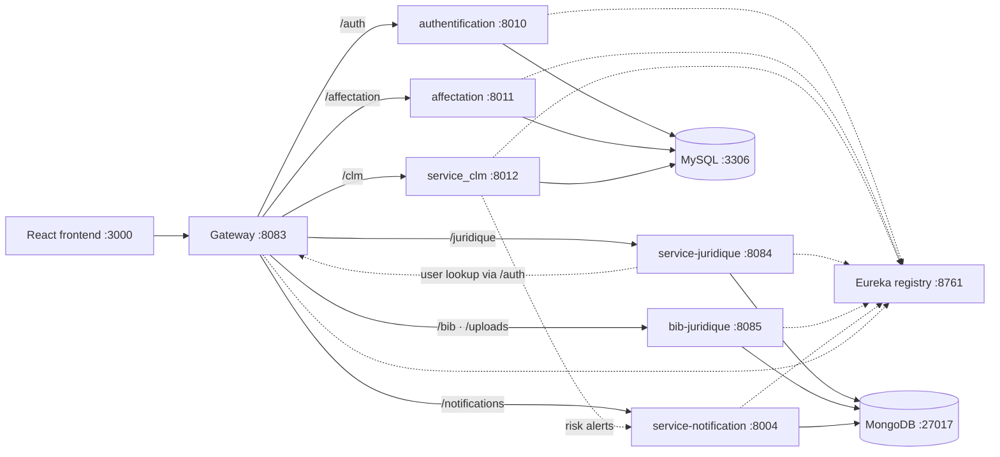

# Lexora Backend — Technical Report

| | |
|---|---|
| **Date** | 15 August 2026 |
| **Repository state** | branch `master`, commit `29834ff` + Aug 2026 hardening fixes (uncommitted at time of writing) |
| **Scope** | All 8 services, configuration, data layer, integrations, tooling |
| **Companion documents** | [`../CLAUDE.md`](../CLAUDE.md) (working guide) · [`deployment/`](deployment/README.md) (VPS deployment guide) · [`features/`](features/README.md) (per-feature docs) · [`archive/CODE_VERIFICATION_REPORT.md`](archive/CODE_VERIFICATION_REPORT.md) (archived build verification) |

---

## 1. System overview

Lexora is a **polyglot microservices backend** for a legal-department management application (Sonatrach context). It covers five business domains — authentication/HR data, organizational structure, a legal document library, contract lifecycle management (CLM) with OCR and risk analysis, and notifications — implemented as six business services behind a **Spring Cloud Gateway**, discovered through a **Netflix Eureka** registry. A React frontend (port 3000) is the single intended client. Code comments, log output, and domain vocabulary are predominantly **French**.

## 2. Technology stack summary

| Layer | Technology | Version |
|---|---|---|
| Edge / routing | Spring Cloud Gateway (Spring Boot parent) | Spring Boot **3.4.4**, Spring Cloud **2024.0.1**, Java **21** |
| Service discovery | Netflix Eureka (spring-cloud-starter-netflix-eureka-server) | same BOM |
| Python services | Django + Django REST Framework | Django **5.1.x**, DRF **3.15**, simplejwt **5.3** |
| Node services | Express | **4.18** (service-juridique) / **5.2** (bib-juridique, service-notification) |
| ODM / ORM | Django ORM (MySQL) · Mongoose | Mongoose **7.6** / **9.6–9.7** |
| Relational DB | MySQL | 8.x expected (`mysqlclient` driver) |
| Document DB | MongoDB | URIs with `authSource=admin` |
| Auth tokens | JWT HS256 (djangorestframework-simplejwt ↔ jsonwebtoken 9) | shared-secret contract, §5 |
| Real-time (declared) | Socket.IO | **4.8** — handler present, not wired (§4.8) |
| OCR | PyMuPDF + pytesseract (Tesseract engine) | PyMuPDF 1.26, pytesseract 0.3.13 |
| Media storage | Cloudinary (`django-cloudinary-storage`) | cloudinary 1.39+/1.44 |
| Email | Gmail SMTP (`django.core.mail`) | app-password auth |
| Discovery clients | `py-eureka-client` 0.11.8 · `eureka-js-client` 4.5 | |
| Build tooling | Maven wrapper (`mvnw`) · pip/venv · npm | |

## 3. Gateway & routing model

`gateway/src/main/resources/application.yml` — port **8083**:

| Route id | Path predicate | Target | Mechanism |
|---|---|---|---|
| authentication-sounatrach | `/auth/**` | `http://localhost:8010` | **hardcoded port** |
| affectation-sounatrach | `/affectation/**` | `http://localhost:8011` | hardcoded port |
| clm-sounatrach | `/clm/**` | `http://localhost:8012` | hardcoded port |
| service-juridique | `/juridique/**` | `lb://service-juridique` | Eureka |
| service-notification | `/notifications/**` | `lb://SERVICE-NOTIFICATION` | Eureka |
| bib-juridique | `/bib/**` | `lb://bib-juridique` | Eureka |
| bib-juridique-uploads | `/uploads/**` | `lb://bib-juridique` | Eureka |

Design facts:

- **All routes use `StripPrefix=0`** — each service mounts its endpoints under its own public prefix. A new endpoint must carry the prefix; a new prefix needs a gateway route.
- Global CORS allows the explicit origins `http://localhost:3000` / `127.0.0.1:3000` / `https://lexora-dz.netlify.app` plus any `http://localhost:<port>` / `http://127.0.0.1:<port>` (`allowedOriginPatterns`, for local frontends on Vite/CRA/Angular ports) with credentials; a `DedupeResponseHeader` default filter prevents duplicated CORS headers (services also set their own).
- Django services register with Eureka but are still routed by fixed port — registration is informational for them; Node services are genuinely load-balanced by discovery.
- The registry (port **8761**) runs with `enable-self-preservation: false` (dev-oriented: fast eviction, mass-eviction risk in production).

## 4. Service-by-service technical sheets

### 4.1 registry — Eureka server

- Spring Boot 3.4.4 app (`spring-cloud-starter-netflix-eureka-server`, `spring-boot-starter-web`), Java 21, port 8761.
- Does not register itself; fetch-registry disabled. Dashboard at `/`.

### 4.2 gateway — Spring Cloud Gateway

- `spring-cloud-starter-gateway` (reactive; deliberately **not** `spring-boot-starter-web`), Eureka client, actuator.
- All behavior in `application.yml` (§3); no custom Java filters/controllers.

### 4.3 authentification — identity & HR core (Django, port 8010)

- **DB**: MySQL `loisonatrach`. **Eureka name**: `AUTHENTICATION-SOUNATRACH`.
- **Custom user model** `api.User` (`AUTH_USER_MODEL`), extending `AbstractBaseUser` + `PermissionsMixin`: email as unique identifier, `nom`/`prenom`, `matricule` (unique employee id), `photo_profil` as `CloudinaryField`, plus HR fields (address, birth date, sex, phone).
- **11 roles** (`ROLE_CHOICES`): `admin`, `agent`, `vice_presedent`, `directeur_direction`, `responsable_departement`, `directeur_centrale`, `assistant_directeur_centrale`, `directeur_direction_activite`, `directeur_division_activite`, `responsable_direction_division`, `responsable_departement_division`. Role strings are consumed by Node middleware for authorization — they are cross-service API surface.
- **JWT issuing** via simplejwt: HS256, signing key = `SECRET_KEY`, access **1 day**, refresh **1 day**, refresh rotation + blacklist (`token_blacklist` app installed).
- **Side capabilities**: sends generated agent passwords by Gmail SMTP; Excel import via `openpyxl` (sample `Classeur1.xlsx` in the service root); `api/discovery.py` resolves other services from Eureka (60 s cache, gateway fallback when `USE_EUREKA=false`).
- Starts its Eureka client from `api/apps.py → ready()` in a daemon thread (`authentification/eureka_client.py`).

### 4.4 affectation-service — assignments (Django, port 8011)

- **DB**: MySQL `affectation-sonatrach` (note the hyphen). **Eureka name**: `AFFECTATION-SOUNATRACH`.
- Defines **no Django models** (`affectation/models.py` is empty) — it is an orchestration/composition layer: its serializers resolve organizational data from service-juridique through the shared discovery helper (`get_juridique_base_url`, `get_gateway_url`).
- Same skeleton as authentification: DRF, simplejwt authentication classes, CORS, Eureka client thread, own `authentication.py`/`permissions.py`.

### 4.5 service_clm — contract lifecycle management (Django, port 8012)

- **DB**: MySQL `clm_sounatrach`. **Eureka name**: `CLM-SOUNATRACH`.
- **Domain models**: `Contrat` (lifecycle states, parties, dates), `MetadonneeContrat` (extracted metadata), `RisqueContrat` (detected risks). A model field records the OCR engine used (`tesseract` / `easyocr` / `azure` choices; only Tesseract is implemented).
- **Pipeline modules** (`clm/`): `contract_parser.py` (structure extraction) → `ocr_utils.py` (text layer: native PyMuPDF text first, Tesseract OCR fallback for scanned pages, honoring an optional `TESSERACT_CMD` setting) → `risk_engine.py` (rule-based risk scoring) → `notification_client.py` (pushes alerts through the gateway to `service-notification`; URL and 5 s timeout from settings) → `resolvers.py` (cross-service data resolution).
- **Media**: `DEFAULT_FILE_STORAGE = MediaCloudinaryStorage` (contract files to Cloudinary).
- Cache: Django `LocMemCache` (60 s TTL) backing discovery lookups.
- `requirements.txt` was a UTF-16 machine freeze (~190 packages) — **replaced Aug 2026** with a curated UTF-8 list (incl. whitenoise + gunicorn).

### 4.6 service-juridique — organizational structure (Node, port 8084)

- Express **4.18**, Mongoose **7.6**, morgan logging, express-validator. **Mongo DB**: `juridique_dbb`.
- **8 Mongoose models**: `Direction`, `Departement`, `Activite`, `DirectionCentrale`, `DirectionActivite`, `DepartementActivite`, `Division`, `Structure` — the org hierarchy including an organigramme endpoint (`/juridique/directions-centrales/:id/organigramme`; the `directions/organigramme` route advertised by the startup banner is commented out).
- Routes under `/juridique/*` (directions, departements, activites, directions-centrales, structure, division, direction_activite, departemet_activite *(sic — typo is part of the API surface)*). Write operations are admin-gated.
- **Auth middleware** (`middleware/auth.js`): verifies the JWT locally against `JWT_SECRET`, then resolves the full user via gateway `GET /auth/all_users/<id>/` with a 10-minute in-memory `Map` cache; role checks use the Django role strings.
- `seed.js` is fully commented out (dead code); `/health` and `/info` at root.

### 4.7 bib-juridique — legal document library (Node, port 8085)

- Express **5.2**, Mongoose **9.7**, **multer 2.1** for uploads. **Mongo DB**: `bib_juridique_db`.
- Single model `DocumentJuridique`; API under `/bib/*`; uploaded files written to **local disk** at `src/uploads/` and served statically at `/uploads` (both paths exposed through the gateway).
- `/health` returns service status plus an uploads file count (the filename listing was removed Aug 2026). API routes now require JWT; delete is admin-only.
- `fix-document-urls.js`: one-off maintenance script rewriting stored document URLs.

### 4.8 service-notification — notifications & messaging (Node, port 8004)

- Express **5.2**, Mongoose **9.6**, Socket.IO **4.8** declared. **Mongo DB**: `notification_base`.
- **Models**: `Conversation`, `Message`, `RiskAlert`.
- Routes: `/notifications/*` behind JWT middleware; **`/notifications/risk-alerts` mounted without auth** (the ingestion endpoint used by service_clm).
- **Socket.IO status**: a complete handler exists (`socket/socketHandler.js` — token handshake, per-user and per-role rooms, `send_message` flow) but `server.js` **never attaches it to the HTTP server**. As deployed, the service is REST-only; the handler also references a `/api/verify-token/` gateway route that does not exist in the gateway config — both would need wiring to activate real-time delivery.

## 5. Cross-cutting technical contracts

### 5.1 Authentication (the shared-secret JWT contract)

1. `authentification` issues HS256 tokens signed with its Django `SECRET_KEY`.
2. Django services verify via simplejwt (same key, same process).
3. Node services verify **locally** with `jsonwebtoken` against `JWT_SECRET` — must be byte-identical to the Django key in `service-juridique/config.env`, `bib-juridique/config.env`, `service-notification/.env`.
4. Node middleware enriches the token with the user record fetched through the gateway (`/auth/all_users/<id>/`, Bearer-forwarded, 10 min cache) and enforces role-based access with the §4.3 role strings.

Failure signature of secret drift: 401s on Node routes only, Django routes fine.

### 5.2 Service discovery

- Eureka server 8761; Django clients register via `py-eureka-client` (daemon thread at app startup, config from per-service `.env`), Node clients via `eureka-js-client` after Mongo connects.
- Exact registered names: `AUTHENTICATION-SOUNATRACH`, `AFFECTATION-SOUNATRACH`, `CLM-SOUNATRACH`, `service-juridique`, `bib-juridique`, `SERVICE-NOTIFICATION` (+ `gateway-service`). Spelling variants are intentional-by-usage; consumers reference them verbatim.
- Django-side lookups (`discovery.py` in each service) call the Eureka REST API directly, cache 60 s, and fall back to the gateway URL when `USE_EUREKA=false`.

### 5.3 Inter-service calls

| Caller | Callee | Path | Purpose |
|---|---|---|---|
| service_clm | service-notification | gateway → `/notifications/risk-alerts` | contract risk alerts (unauthenticated endpoint) |
| Node auth middleware (×3) | authentification | gateway → `/auth/all_users/<id>/` | user/role resolution |
| affectation serializers | service-juridique | Eureka-resolved base URL | org-structure composition |

## 6. Data layer

### MySQL (relational)

| Schema | Owner service | Content |
|---|---|---|
| `loisonatrach` | authentification | users (11-role model), auth tokens, blacklist |
| `affectation-sonatrach` | affectation-service | Django system tables only (no domain models) |
| `clm_sounatrach` | service_clm | contracts, metadata, risks |

### MongoDB (document)

| Database | Owner service | Collections (from models) |
|---|---|---|
| `juridique_dbb` | service-juridique | directions, departements, activites, directions centrales, divisions, structures, junction collections |
| `bib_juridique_db` | bib-juridique | documents juridiques |
| `notification_base` | service-notification | conversations, messages, risk alerts |

### Binary/media storage

- **Cloudinary**: profile photos (authentification), contract media (service_clm).
- **Local disk**: `bib-juridique/src/uploads/` — the document library's file store; single point of data loss, include in backups.

## 7. Configuration inventory

| Service | File | Notable keys |
|---|---|---|
| authentification | `.env` | Eureka (8010) + `SECRET_KEY`, `DEBUG`, `ALLOWED_HOSTS`, `DB_*`, email, Cloudinary |
| affectation-service | `.env` | Eureka (8011) + `SECRET_KEY`, `DEBUG`, `ALLOWED_HOSTS`, `DB_*` |
| service_clm | `.env` | Eureka (8012) + `SECRET_KEY`, `DEBUG`, `ALLOWED_HOSTS`, `DB_*`, Cloudinary, `TESSERACT_CMD` |
| service-juridique | `config.env` | `PORT`, `MONGODB_URI`, Eureka, `GATEWAY_URL`, `JWT_SECRET` |
| bib-juridique | `config.env` | same pattern (8085) |
| service-notification | `.env` | same pattern (8004) + `EUREKA_SERVICE_NAME` |
| gateway / registry | `application.yml` | ports, routes, CORS, Eureka |

Since Aug 2026 the Django services read `SECRET_KEY`, `DEBUG`, `ALLOWED_HOSTS`, DB credentials, email, and Cloudinary from their `.env` via `python-decouple` (committed `*.env.example` templates document the shape). Still hardcoded: CORS origin lists and gateway route targets. Production env-file layouts: [deployment/04-configuration.md](deployment/04-configuration.md).

## 8. Build, tooling & quality

- **Java**: Maven wrapper per module; `spring-boot-maven-plugin`; requires JDK 21 (`<java.version>21</java.version>`).
- **Python**: plain `requirements.txt` per service (no lockfiles); all three lists are curated since the Aug 2026 replacement of service_clm's freeze dump (§4.5).
- **Node**: npm; `package-lock.json` present in service-juridique and service-notification; bib-juridique has **`node_modules` committed** to git (~13k files).
- **Docker**: gateway/registry Dockerfiles are active but expect a pre-built jar (`FROM openjdk:21`); authentification's Dockerfile and `entrypoint.sh` are commented-out/dev-grade (port 8000 mismatch); no Dockerfiles for the other four services; **no docker-compose**.
- **Tests**: none in practice — Django stub `tests.py` files, placeholder npm `test` scripts, Spring context-load tests only. No CI configuration in the repository.
- **Logging**: morgan dev-format (service-juridique), console `console.log` elsewhere, Django defaults; no structured/centralized logging.

## 9. Known issues & technical debt (condensed register)

Full remediation detail lives in the deployment guide and the deployment report; identifiers G-1…G-13 are shared across documents.

| ID | Severity | Issue |
|---|---|---|
| G-1 | Critical | Live secrets committed to git history (SECRET_KEY/JWT, Gmail app password, Cloudinary secret, DB passwords) — rotate, externalize |
| G-2 | ~~Critical~~ Fixed in code | `DEBUG`/`ALLOWED_HOSTS` now env-driven (default `DEBUG=False`); dev `.env` sets `DEBUG=True` |
| G-3 | Critical | Java build requires JDK 21; older toolchains fail (`release version 21 not supported`) |
| G-4 | ~~Critical~~ Fixed | `service_clm/requirements.txt` replaced with a curated UTF-8 list (Aug 2026) |
| G-5 | High | Dev servers only (`runserver`, nodemon); no WSGI/process manager in repo |
| G-6 | High | CORS + service URLs hardcoded to localhost; Django routed by fixed ports |
| G-7 | High | `/notifications/risk-alerts` unauthenticated |
| G-8 | High (partly fixed) | bib-juridique uploads on local disk (remains); `/health` filename listing removed and `/bib` routes now JWT-protected (Aug 2026) |
| G-9 | High | No automated tests / CI |
| G-10 | Medium | JWT access-token lifetime 1 day (comment claims 1 hour) |
| G-11 | Medium | In-memory caches only (locmem / Map) — single-instance assumption |
| G-12 | Medium | Eureka self-preservation disabled |
| G-13 | Medium (partly fixed) | Junk root files deleted and `.gitignore` extended (Aug 2026); still committed: `node_modules` (bib-juridique), `service_clm/db.sqlite3`, sample xlsx |
| — | Note | Socket.IO handler present but never attached (§4.8); `departemet_activite` route typo is live API surface; `PUT /juridique/activites/:id` create-instead-of-update bug fixed Aug 2026 |

## 10. Port & identity reference

| Port | Service | Eureka name | Public prefix |
|---|---|---|---|
| 8761 | registry | — | — |
| 8083 | gateway | gateway-service | (all) |
| 8010 | authentification | AUTHENTICATION-SOUNATRACH | `/auth` |
| 8011 | affectation-service | AFFECTATION-SOUNATRACH | `/affectation` |
| 8012 | service_clm | CLM-SOUNATRACH | `/clm` |
| 8084 | service-juridique | service-juridique | `/juridique` |
| 8085 | bib-juridique | bib-juridique | `/bib`, `/uploads` |
| 8004 | service-notification | SERVICE-NOTIFICATION | `/notifications` |
| 3306 | MySQL | — | — |
| 27017 | MongoDB | — | — |
| 3000 | React frontend (external) | — | — |
